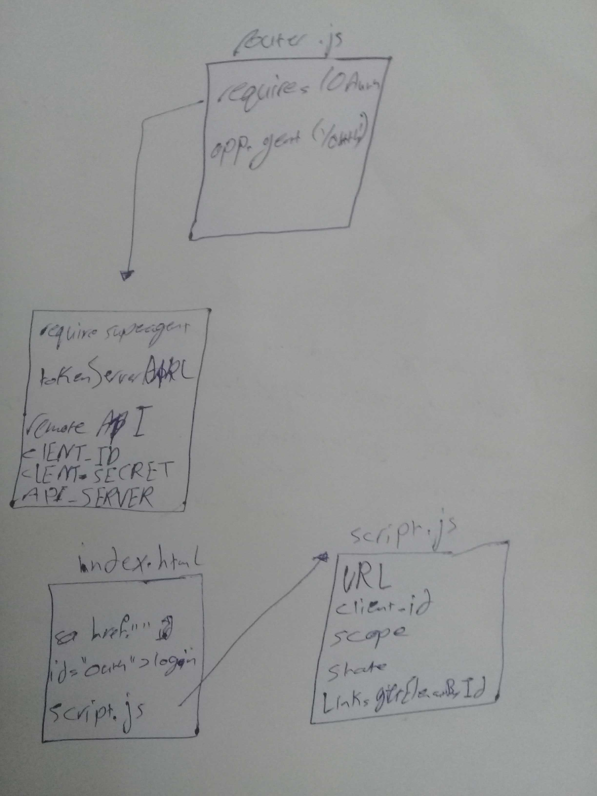

# LAB - Class 112

## Project: Authentication

### Author: Hammad Ali

## Modules
### server.js
### 404.js
### 500.js

### Setup
#### .env requirements
* PORT
* MONGODB_URI 
* SECRET 
* CLIENT_ID
* CLIENT_SECRET
* API_SERVER

#### How to initialize/run your application 
* `npm start`
* EndPoint: `/users` 
* EndPoint: `/signin` 
* EndPoint: `/signup` 
* EndPoint: `/oauth` 

#### How to use your library 
#### Tests
- Lint test: `npm run lint`
- unit test: `npm test`

#### UML

