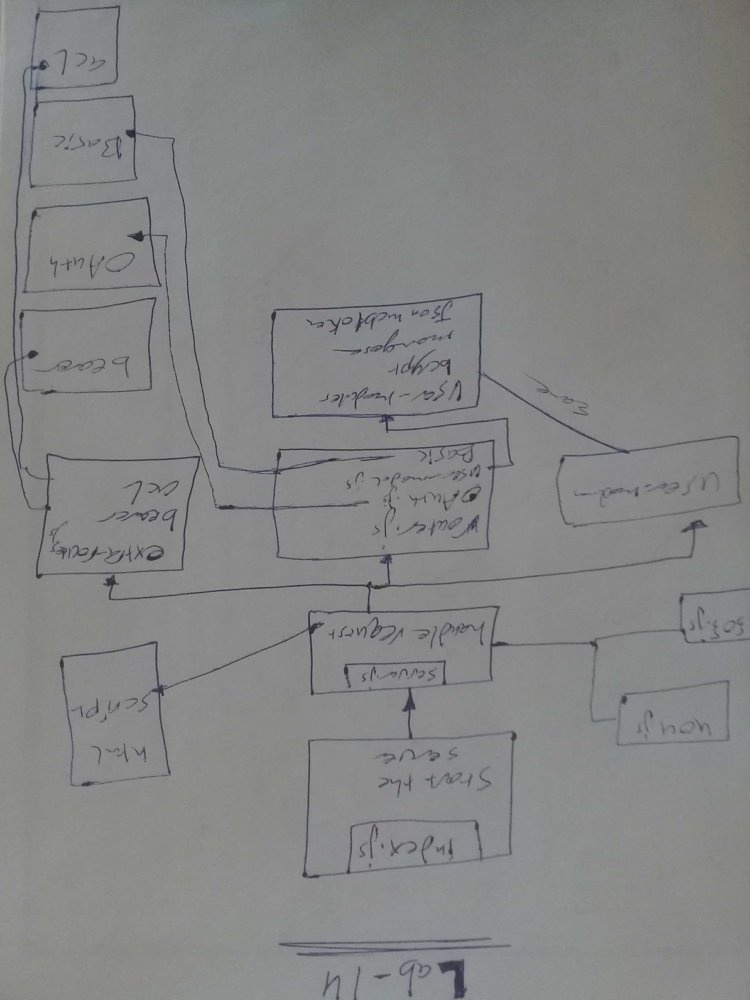

# LAB - Class 14

## Project: Authentication

### Author: Hammad Ali

### Modules
* server.js
* 404.js
* 500.js
* extra-route

### Setup
* .env requirements
* PORT - Port Number
* MONGODB_URI 
* SECRET
* CLIENT_ID 
* CLIENT_SECRET

### How to initialize/run your application
* npm start
* EndPoint: /
* EndPoint: /users
* EndPoint: /secret 
* EndPoint: /signin
* EndPoint: /signup
* EndPoint: /read
* EndPoint: /add
* EndPoint: /change
* EndPoint: /remove

### How to use your library
* Tests
* Lint test: npm run lint
* unit test: npm test

### UML

